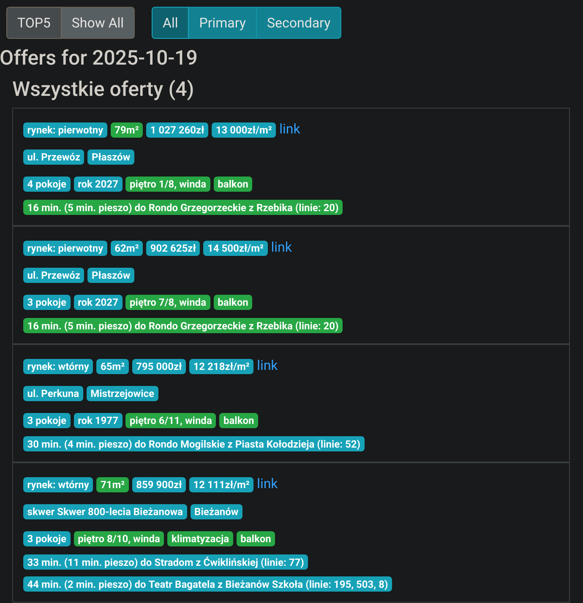

# Flatscraper

Finding apartments across multiple listing sites is time-consuming and difficult
to track. Flatscraper addresses this challenge by:

- Extracting property data from major real estate websites: otodom.pl, olx.pl,
  nieruchomosci-online.pl, and morizon.pl.
- Scoring offers based on attributes such as public transport accessibility,
  price per square meter, area, and availability of special features like balconies.
- Generating aggregated feeds that match specific criteria, delivered via
  multiple channels: e-mail digests, HTML, and RSS feeds.
- Storing data in a SQLite database, enabling custom ETL queries.

## Screenshots
Daily offer web feed:

RSS feed (as viewed in [miniflux](https://github.com/miniflux/v2)):

## Design Notes

- **City-specific configuration**: Currently optimized for Krakow, Poland, with
  dedicated transport hubs and points of interest.
- **Offline public transport accessibility scoring**: Calculated
  locally using the loaded GTFS schedule (thanks to the [mobroute project](https://sr.ht/~mil/mobroute/).)
- **SQLite-centric**: All data is stored and processed in SQLite.

## Command-line Tools

The project provides several executables:

- `flatscraper-scrape`: Extract new offers
- `flatscraper-process-location`: Enrich offers with location data
- `flatscraper-gen-feed`: Generate HTML/RSS feeds
- `flatscraper-send-digest`: Send email digests

## Setup and Installation

1. Install Haskell Stack.
2. Install [mobroute](https://sr.ht/~mil/mobroute/) and load the GTFS schedule.
3. Clone this repository and run `stack build`.
4. Create an SMTP credentials file (for email functionality).
5. Run the desired command-line tool. For periodic scraping, consider installing systemd units.
6. Set up a web server and copy `index.html` to the webroot. Configure cron or systemd
   timers to generate HTML/RSS feeds automatically.

## Project Background
This project was created before property listing sites began offering e-mail
notifications for new offers matching specified filters. The goal was to
automate offer filtering, reducing the number of listings that required
human review. One challenge was eliminating duplicates of a single offer,
re-posted multiple times across different sites. The project started in April 2019.

By 2025, most sites had implemented new offer notifications, but this did not solve
the issue of receiving multiple notifications for a single re-posted offer.
At that point, the scoring system was introduced to help identify unusual offers
in the market.
the problem with getting multiple notifications for a single re-posted offer.
At this time came the scoring system to catch unusual offers in the market.
